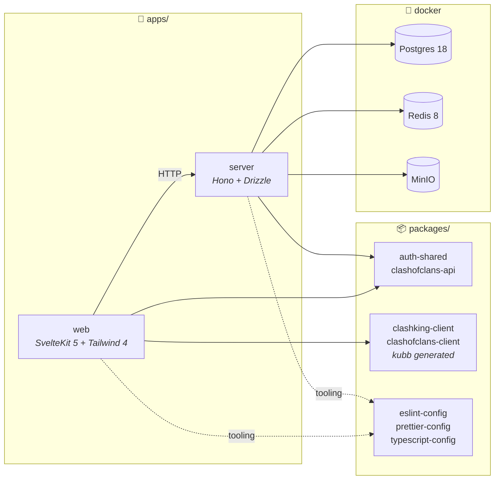
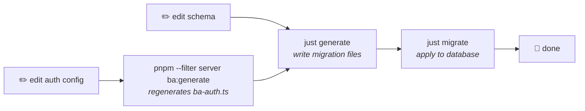

# 🤝 Contributing

Thank you for considering contributing to ClashwithJPA!
This guide takes you from a clean machine to a running dev environment. Join our Discord if you get stuck at any point.

## 🗺️ How the repo fits together

This is a [Turborepo](https://turborepo.com) monorepo. Two apps, a handful of shared packages, and one standalone container script.



| Path                             | What it is                                                                                                         |
| -------------------------------- | ------------------------------------------------------------------------------------------------------------------ |
| `apps/web`                       | SvelteKit 5 frontend, also packaged for Android and iOS through Capacitor                                          |
| `apps/server`                    | Hono API, Drizzle ORM, better-auth, OpenAPI docs served by Scalar                                                  |
| `packages/auth-shared`           | Auth types and access control shared by both apps                                                                  |
| `packages/clashofclans-api`      | Typed wrapper around the Clash of Clans API                                                                        |
| `packages/*-client`              | API clients generated from OpenAPI specs by [kubb](https://kubb.dev)                                               |
| `packages/*-config`              | Shared eslint, prettier and tsconfig presets                                                                       |
| ⚠️ `scripts/containers/cwl-ping` | Standalone container job, has its own lockfile and is not part of the workspace. (_Discord Webhook to ping users_) |

## 🧰 Prerequisites

1. PNPM

Read the [docs](https://pnpm.io/installation) for your platform and install it.

2. Node.js

Let `pnpm i` it. The version is pinned in [`.node-version`](.node-version).

```sh
pnpm runtime set node 24 -g
```

3. Docker and just

- [`docker`](https://docs.docker.com/get-started/get-docker) with Compose, for Postgres, Redis and MinIO.
- [`just`](https://github.com/casey/just), the command runner used for every docker and database task here.

## 🚀 Setup

1. Install dependencies

```sh
pnpm i
```

2. Create the docker network

Compose expects an external network, so it will not create this for you.

```sh
docker network create clashwithjpa-network
```

> [!WARNING]
> Skip this and every `just run` fails with `network clashwithjpa-network declared as external, but could not be found`. You only need to do it once per machine.

3. Copy the env files

There are three, one per concern. Copy all of them.

```sh
cp apps/server/.env.example apps/server/.env
cp apps/server/.env.server-db.example apps/server/.env.server-db
cp apps/web/.env.example apps/web/.env
```

<details>
<summary><b><code>apps/server/.env</code></b>: everything the API needs. Missing a required key throws on boot with the name of the offender.</summary>

| Key                        | Type  | Required | Description                                                                                |
| -------------------------- | ----- | -------- | ------------------------------------------------------------------------------------------ |
| `JPA_AUTH_SECRET`          | `str` | ✅       | Signing secret for better-auth sessions.                                                   |
| `JPA_AUTH_URL`             | `str` | ✅       | Where the API itself is reachable. `http://localhost:3000` locally.                        |
| `JPA_APP_URL`              | `str` | ✅       | Where the web app is reachable, used for CORS and auth redirects.                          |
| `JPA_DATABASE_URL`         | `str` | ✅       | Postgres connection string. The default already points at the docker container.            |
| `JPA_REDIS_URL`            | `str` | ✅       | Redis connection string, backs rate limiting and caching.                                  |
| `PUBLIC_COC_API_BASE_URI`  | `str` | ✅       | Clash of Clans API base. Defaults to the RoyaleAPI proxy, so no static IP needed.          |
| `JPA_COC_API_TOKEN`        | `str` | ✅       | Clash of Clans API token, from the [developer portal](https://developer.clashofclans.com). |
| `JPA_DISCORD_ID`           | `str` | ✅       | Discord OAuth application ID, used for sign in.                                            |
| `JPA_DISCORD_SECRET`       | `str` | ✅       | Discord OAuth client secret.                                                               |
| `JPA_DISCORD_BOT_TOKEN`    | `str` | ✅       | Bot token, used to read guild membership and roles.                                        |
| `JPA_TURNSTILE_SECRET_KEY` | `str` | ✅       | Cloudflare Turnstile secret, the server side of the captcha.                               |
| `SENTRY_DSN`               | `str` | ❌       | Sentry project DSN. Leave empty locally.                                                   |
| `SENTRY_SPOTLIGHT`         | `str` | ❌       | `1` sends errors to the local Spotlight container instead of Sentry.                       |
| `PORT`                     | `int` | ❌       | Port the API listens on. Defaults to `3000`.                                               |

> [!TIP]
> Generate the auth secret with:
>
> ```sh
> openssl rand -base64 32
> ```

</details>

<details>
<summary><b><code>apps/server/.env.server-db</code></b>: read by the docker containers <i>and</i> by the API, so both sides stay in sync. The defaults work as is.</summary>

| Key                   | Type  | Required | Description                                                            |
| --------------------- | ----- | -------- | ---------------------------------------------------------------------- |
| `POSTGRES_USER`       | `str` | ✅       | Superuser the Postgres container creates on first boot.                |
| `POSTGRES_PASSWORD`   | `str` | ✅       | Its password. Has to match whatever is in `JPA_DATABASE_URL`.          |
| `POSTGRES_DB`         | `str` | ✅       | Database name created on first boot.                                   |
| `MINIO_ROOT_USER`     | `str` | ✅       | MinIO access key, doubles as the console login.                        |
| `MINIO_ROOT_PASSWORD` | `str` | ✅       | MinIO secret key.                                                      |
| `MINIO_ENDPOINT`      | `str` | ✅       | Where the API talks to MinIO, the S3 API on `7105`.                    |
| `MINIO_PUBLIC_URL`    | `str` | ✅       | Base URL baked into uploaded file links. Same as the endpoint locally. |

</details>

<details>
<summary><b><code>apps/web/.env</code></b>: everything here is <code>PUBLIC_</code>, meaning SvelteKit ships it to the browser.</summary>

| Key                         | Type  | Required | Description                                                        |
| --------------------------- | ----- | -------- | ------------------------------------------------------------------ |
| `PUBLIC_SERVER_URL`         | `str` | ✅       | Base URL of the API the browser calls.                             |
| `PUBLIC_TURNSTILE_SITE_KEY` | `str` | ✅       | Turnstile site key, the public half of `JPA_TURNSTILE_SECRET_KEY`. |
| `PUBLIC_SENTRY_DSN`         | `str` | ❌       | Browser Sentry DSN. A different project from the server's.         |
| `PUBLIC_SENTRY_SPOTLIGHT`   | `str` | ❌       | `1` routes browser errors to the local Spotlight container.        |

> [!WARNING]
> Never put a secret in a `PUBLIC_` variable. Vite inlines them into the bundle at build time, so they ship to every visitor. For production, override them in `apps/web/.env.production`.

Sentry is optional locally, `SENTRY_SPOTLIGHT=1` already routes errors to the local Spotlight container. The Discord and Turnstile credentials are yours to create, both are free.
</details>

<details>
<summary>🤖 Creating your own Discord application</summary>

Everything comes from the [Discord Developer Portal](https://discord.com/developers/applications). Create a **New Application**, then:

| Where                      | What to grab          | Goes into               |
| -------------------------- | --------------------- | ----------------------- |
| **General Information**    | Application ID        | `JPA_DISCORD_ID`        |
| **OAuth2** → Client Secret | Reset Secret, copy it | `JPA_DISCORD_SECRET`    |
| **Bot** → Token            | Reset Token, copy it  | `JPA_DISCORD_BOT_TOKEN` |

Two settings also need changing:

1. **OAuth2 → Redirects**, add `http://localhost:3000/api/auth/callback/discord`. Sign in fails with `invalid_redirect_uri` without it.
2. **Bot → Privileged Gateway Intents**, turn on **Server Members Intent**. The API lists guild members through [discord.ts](apps/server/src/lib/discord.ts), and Discord rejects that endpoint without the intent.

Then invite the bot to a test guild you control, since it reads that guild's roles, channels and members. The OAuth scopes the app requests are `identify`, `email`, `guilds` and `guilds.members.read`.

</details>

<details>
<summary>🛡️ Getting Turnstile keys</summary>

The quickest path for local work is Cloudflare's [test keys](https://developers.cloudflare.com/turnstile/troubleshooting/testing/), which need no account and always pass:

```sh
# apps/web/.env
PUBLIC_TURNSTILE_SITE_KEY=1x00000000000000000000AA

# apps/server/.env
JPA_TURNSTILE_SECRET_KEY=1x0000000000000000000000000000000AA
```

They only validate against each other, so both have to be the test pair. For real keys, go to the [Cloudflare dashboard](https://dash.cloudflare.com) → **Turnstile** → **Add widget**, add `localhost` as a hostname, and take the **Site Key** and **Secret Key** from there.

</details>

4. Start the services

```sh
just run all
```

5. Set up the schema

```sh
just migrate
```

> [!TIP]
> Optionally seed a few tables:
>
> ```sh
> pnpm --filter server dataset:migrate
> ```

> [!NOTE]
> Seeding needs `.csv` files in `apps/server/scripts/migrations/datasets/` that are not committed to the repo.

6. Run it

```sh
pnpm run dev
```

| App      | URL                                | Notes                             |
| -------- | ---------------------------------- | --------------------------------- |
| Web      | http://localhost:5173              | Vite dev server                   |
| Server   | http://localhost:3000              | Serves the Scalar API docs at `/` |
| API spec | http://localhost:3000/openapi.json | Raw OpenAPI document              |

## 💻 Daily development

Every task runs through Turborepo from the repo root.

| Command                 | What it does                           |
| ----------------------- | -------------------------------------- |
| `pnpm run dev`          | Web and server together, in watch mode |
| `pnpm run build`        | Build everything in dependency order   |
| `pnpm run typecheck`    | Typecheck every workspace              |
| `pnpm run lint`         | ESLint across the monorepo             |
| `pnpm run lint:fix`     | Same, with autofix                     |
| `pnpm run format`       | Prettier write                         |
| `pnpm run format:check` | Prettier check, no writes              |

> [!TIP]
> Scope any command to one workspace with `--filter`:
>
> ```sh
> pnpm --filter web dev
> pnpm --filter server dev
> pnpm --filter web check
> ```
>
> Run `just` on its own to see every available docker and database command.

## 🗄️ Working with the database

Schema lives in `apps/server/src/lib/db/schema`. The flow is generate, then apply.



> [!IMPORTANT]
> Never hand-edit `ba-auth.ts`. It is generated from the better-auth config, so any manual change is overwritten the next time someone runs `ba:generate`.

Other useful bits:

| Command                          | Purpose                                |
| -------------------------------- | -------------------------------------- |
| `just db-reset`                  | Drop the docker volume and start clean |
| `pnpm --filter server db:studio` | Open Drizzle Studio                    |
| `just migrate`                   | Apply pending migrations               |

After `just db-reset` you need to run `just migrate` again, the volume took the schema with it.

## 🔌 Local service ports

| Service         | URL                   | Notes                                           |
| --------------- | --------------------- | ----------------------------------------------- |
| Web             | http://localhost:5173 | Vite dev server                                 |
| Server          | http://localhost:3000 | Hono, API docs at `/`                           |
| Postgres        | `localhost:7101`      | defaults are `postgres` / `postgres` / db `jpa` |
| Redis           | `localhost:7102`      |                                                 |
| Drizzle Gateway | http://localhost:7103 | Browse the database                             |
| Redis Insight   | http://localhost:7104 | Browse the cache                                |
| MinIO API       | http://localhost:7105 | S3 compatible storage                           |
| MinIO Console   | http://localhost:7106 | login `jpa` / `miniopass`                       |
| Spotlight       | http://localhost:8969 | Local Sentry errors and traces                  |

> [!IMPORTANT]
> If you touched anything visual, read [DESIGN.md](DESIGN.md) first. It documents the palette, spacing, radii, z-index scale and motion rules the site sticks to.

## 📝 Commit conventions

Commits follow [Conventional Commits](https://www.conventionalcommits.org), enforced by commitlint through a git hook.

```
<type>(<optional scope>): <description>
```

```sh
git commit -m "feat(cwl): add league filter to the roster table"
git commit -m "fix(auth): stop refresh tokens expiring early"
```
